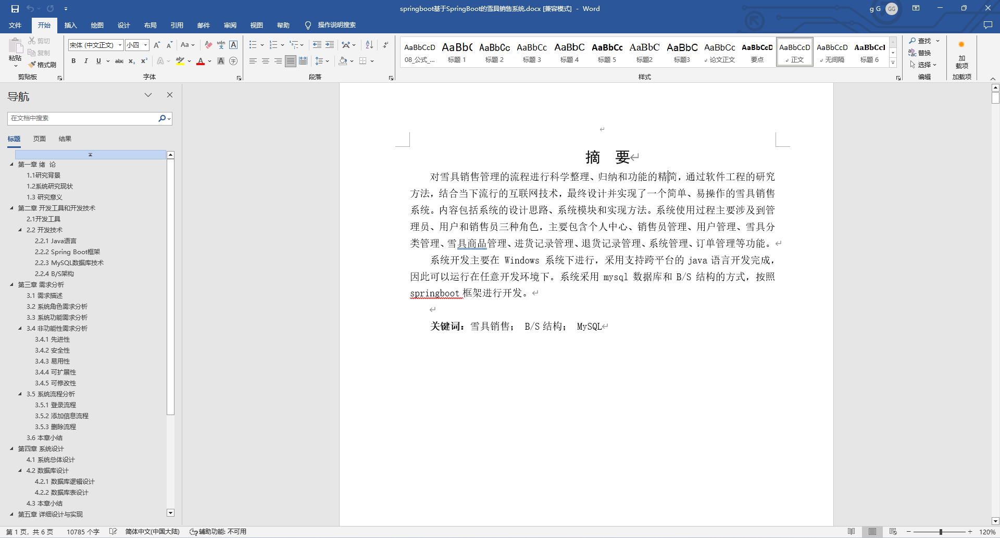
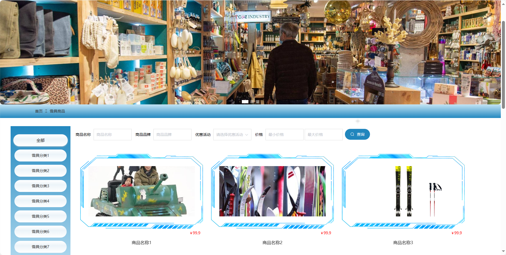
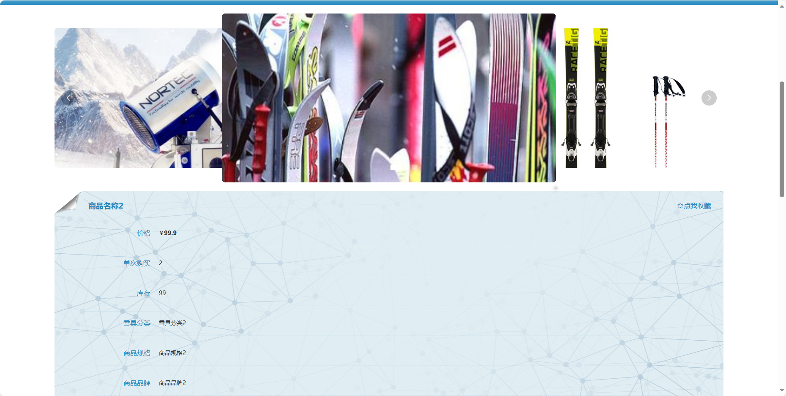
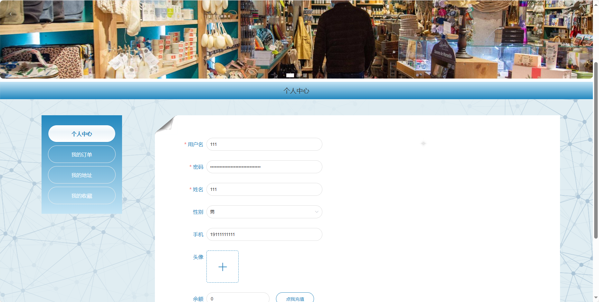
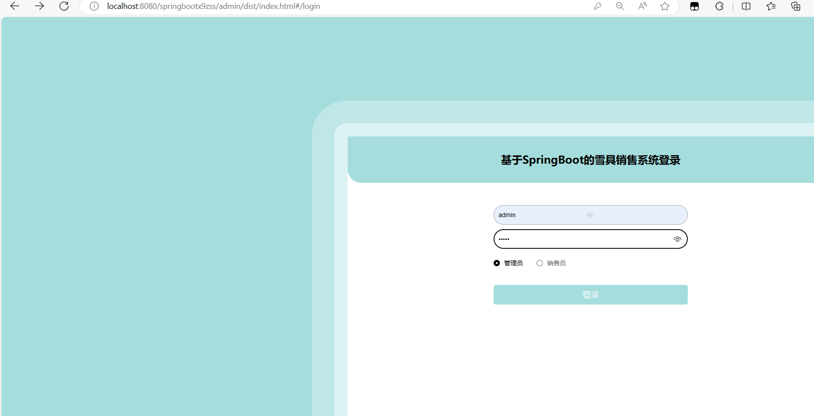
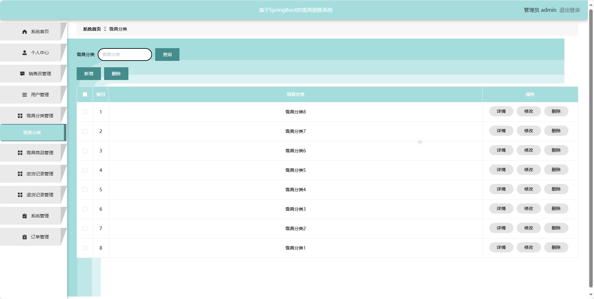
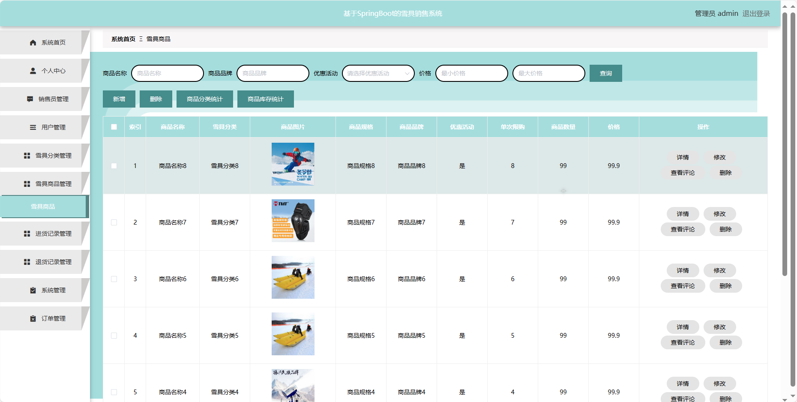
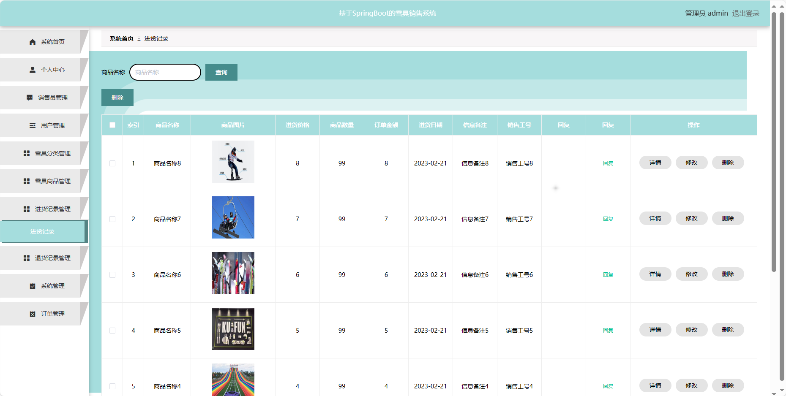
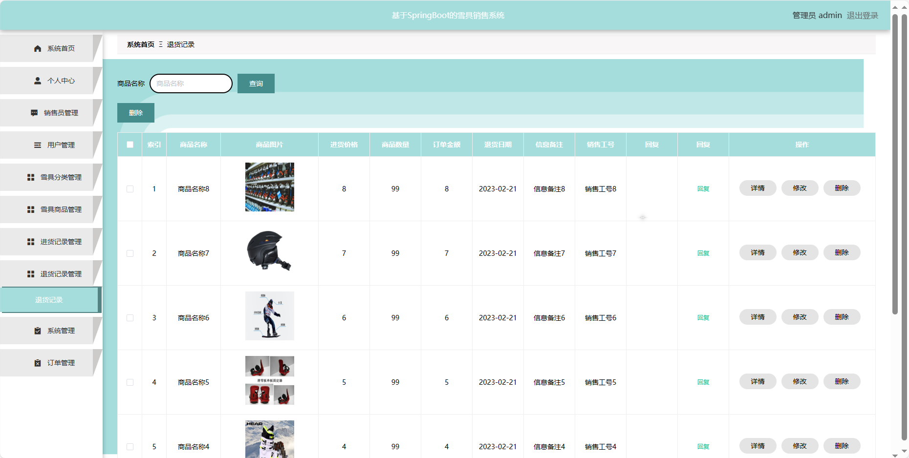
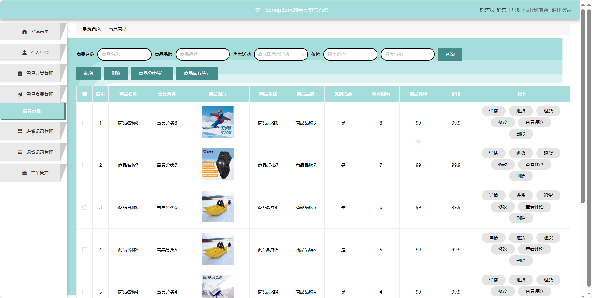

## 基于SpringBoot的雪具销售系统(程序+报告)

- <b>完整代码获取地址：从戎源码网 ([https://armycodes.com/](https://armycodes.com/))</b>
- <b>技术探讨、资料分享，请加QQ群：692619798</b> 
- <b>作者微信：19941326836  QQ：952045282</b> 
- <b>承接计算机毕业设计、Java毕业设计、Python毕业设计、深度学习、机器学习</b>
- <b>选题+开题报告+任务书+程序定制+安装调试+论文+答辩ppt 一条龙服务</b>
- <b>所有选题地址 ([https://github.com/YuLin-Coder/AllProjectCatalog](https://github.com/YuLin-Coder/AllProjectCatalog)) </b>

## 项目介绍
基于SpringBoot的雪具销售系统，系统包含三种角色：管理员、用户,销售员，系统分为前台和后台两大模块，主要功能如下。

### 【管理员】:
- 系统首页：管理员后台的主页。
- 个人中心：管理员个人信息管理，修改密码和查看个人信息。
- 销售员管理：添加、编辑、删除销售员账号。
- 用户管理：添加、编辑、删除用户账号。
- 雪具分类管理：管理雪具商品的分类信息。
- 雪具商品管理：添加、编辑、删除雪具商品信息。
- 进货记录管理：查看和管理雪具商品的进货记录。
- 退货记录管理：查看和管理雪具商品的退货记录。
- 系统管理：系统参数的管理，如雪具商品的计量

### 【销售员】:
- 系统首页：销售员后台的主页。
- 个人中心：销售员个人信息管理。
- 雪具分类管理：管理雪具商品的分类信息。
- 雪具商品管理：添加、编辑、删除雪具商品信息。
- 进货记录管理：查看和管理雪具商品的进货记录。
- 退货记录管理：查看和管理雪具商品的退货记录。
- 订单管理：查看和管理用户购物订单信息。

### 【前台】:
首页：展示系统的主要信息和推荐内容。
雪具商品：列出可购买的雪具商品列表。
公告信息：显示系统相关的公告和通知信息。
客服中心：提供在线客服支持。
购物车：管理用户选择的商品，。
个人中心：用户个人信息管理，订单历史、个人设置等。

## 项目技术
- 编程语言：Java
- 数据库：MySQL
- 项目管理工具：Maven
- 前端技术：HTML、CSS、JavaScript、Jquery、Vue
- 后端技术：Spring、SpringMVC、MyBatis

## 运行环境
- JDK版本：JDK1.8及以上
- 开发工具：IDEA、Ecplise、Myecplise都可以
- 数据库: MySQL5.7及以上
- Maven：maven3.0及以上
- Node：14.14.0及以上

## 运行截图

